# 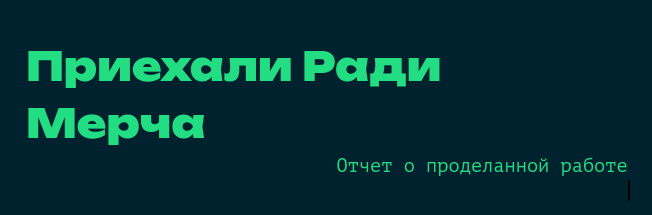

## Web3

В коде сервера сразу заметна потенциальная уязвимость SSTI на эндпоинте `/flag`. Однако так просто получить к нему доступ нельзя:  


В haproxy.cfg видно, что прокси блокирует все запросы, начинающиеся с `/flag`:

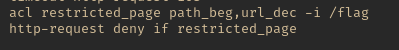
  
Пробуем обойти блокировку, добавив дополнительный слеш (`//flag`):
  
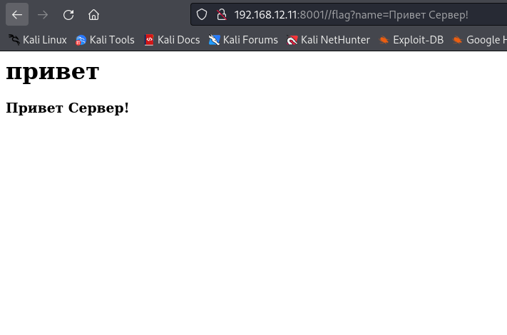

Получилось! Теперь надо обойти фильтр и эксплуатировать SSTI.

1. Фильтр запрещенных символов (скобок и тд) не работал, т.к. в валидации использовался регекс `\w+`
2. Для обхода запрещенных кодовых слов нами использовались конструкции вида: `{...|attr(request.args.attribute)...&attribute=forbiden_keyword}`

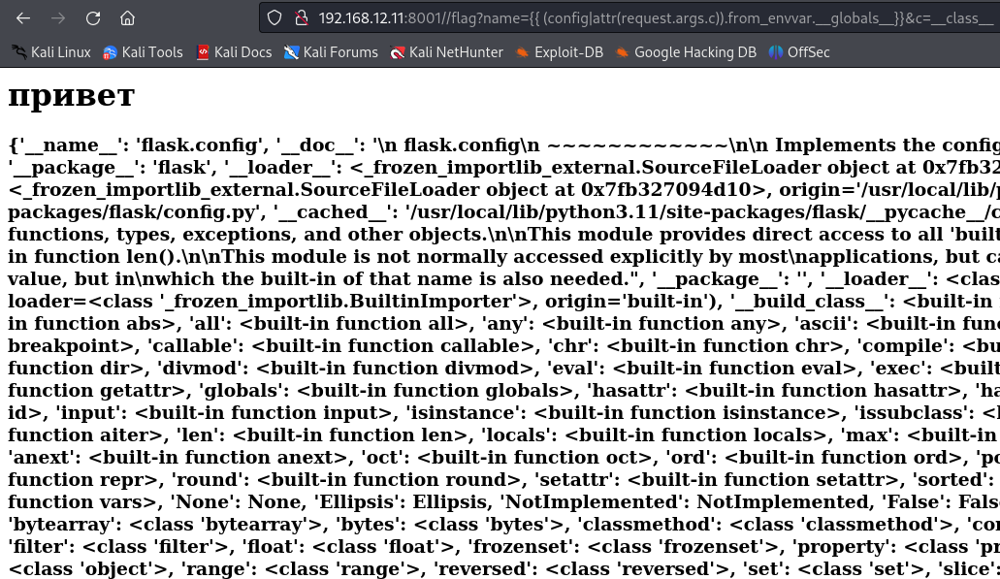

Получив доступ к объекту builtins, мы смогли считать файл с флагом `(...__globals__.builtins.open(“flag.txt”).read())`
  
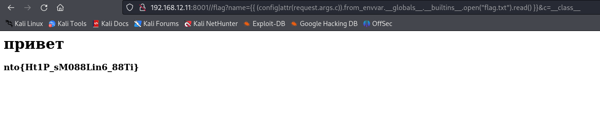

Итоговый пейлоад: `http://192.168.12.11:8001//flag?name={{%20(config|attr(request.args.c)).from_envvar.__globals__.__builtins__.open(%22flag.txt%22).read()%20}}&c=__class__`

## Crypto1

В этой задаче для получения флага было необходимо подобрать пин-код, который использовался для шифрования алгоритмом AES-CBC на сервере. Данный алгоритм использует три значения для шифрования:

1. Вектор Инициализации (IV) 
2. Исходный текст
3. Ключ шифрования

Прочитав представленный программный код сервера, на котором происходила шифровка, мы заметили, что в качестве IV используется не случайное число, а текущее время. 

Таким образом, шифрование подвержено описанной тут атаке:
https://stackoverflow.com/questions/3008139/why-is-using-a-non-random-iv-with-cbc-mode-a-vulnerability

Генерируем шифр с известным IV (i_k):

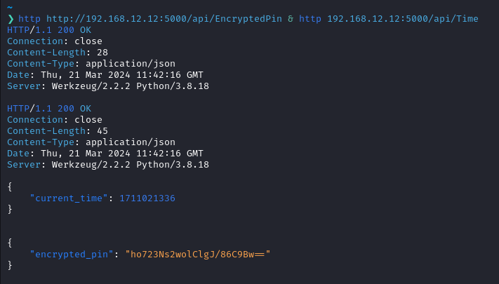

Пишем функцию, генерирующую запрос на сервер:

1.  Функция получает на вход пин-код `(p)`
2.  Генерирует IV из текущего времени `(i_c)`
3.  Возвращает `xor(p, i_k, i_c)`

Перебираем циклом все возможные пин-коды, обрабатываем их функцией и отправляем результат на сервер. Для верного пин-кода результат шифрования должен совпадать с результатом на скриншоте выше.

Получаем пин-код 3561, отправляем на сервер и получаем флаг.

*(кода нет, потому что мы писали его в REPL питона, и он не сохранился, нам сказали, что можно просто описать словами 🙂)*

## Web1

Нажав на ссылку в веб приложении видим эндпоинт для скачивания файла

http://192.168.12.10:5001/download?file_type=file1.txt

Пользуемся уязвимостью directory traversal и получаем флаг:

http://192.168.12.10:5001/download?file_type=../../etc/secret

## Web2

Для начала декомпилируем jar файл. Видим данную функцию:
  
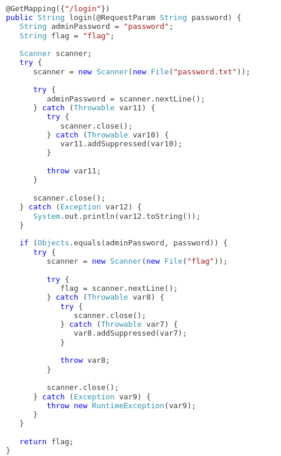

Замечаем, что если считать файл password.txt не получится, переменная `adminPassword` будет равна “password”. Значит файл надо каким-то образом удалить. В этом нам поможет этот метод:

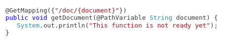

Spring считает введенный параметр document частью названия файла шаблона

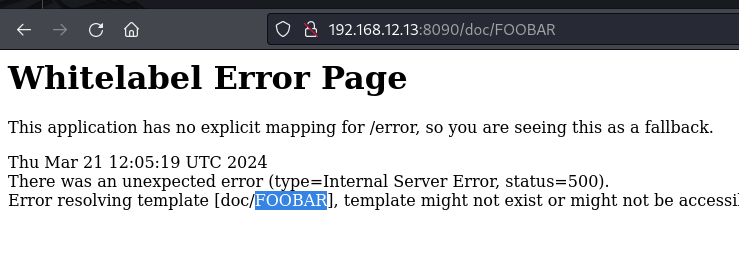

Мы можем воспользоваться уязвимостью Spring View Manipulation чтобы получить доступ к RCE и удалить файл.

https://0xn3va.gitbook.io/cheat-sheets/framework/spring/view-manipulation

`http://192.168.12.13:8090/doc/__${T(java.lang.Runtime).getRuntime().exec("rm password.txt")}__::.x`

Отправляем запрос на полученную ссылку, подставляем в login параметр `password=password` и получаем флаг.

## Форензика 1

Для начала попытаемся узнать, как пользователь заразился вирусом.

Самый очевидный вариант - из браузера, но в истории браузера никаких подозрительных сайтов нет.

Второй возможный вариант - из почты. Немного поискав, находим в папке AppData файл из Microsoft Outlook - `company_worker123@rambler.ru.ost`

Открываем файл через https://goldfynch.com и сразу видим подозрительное письмо:

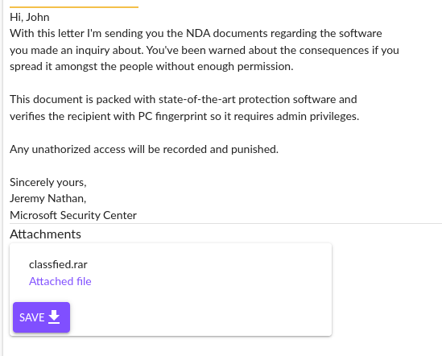

У нас есть ответ на 1 вопрос - пользователь заразился вирусом из письма. Далее открываем архив из письма. Внутри мы видим файл TOP_SECRET.pdf и папку с таким же названием, внутри которой находится файл “TOP_SECRET.pdf .cmd”. Это показывает, что использовалась уязвимость в программе WinRar **(ответ на 3 вопрос)**. Смотрим содержимое файла cmd и получаем ответ на вопрос 2 - вирус загружается с адреса 95.169.192.220:8080.
Запускаем файл вируса и одновременно с этим делаем две вещи:

1.  Запускаем на хосте Wireshark
2.  Снимаем дамп памяти процесса через procdump

В Wireshark мы видим, что сразу после открытия вируса отправляются запросы на api.telegram.org, значит злоумышленник отправляет себе данные через телеграм бота **(вопрос 7)**.

Вводим `strings file.dmp`, чтобы найти строки в дампе памяти. Находим интересные строки:

1.  Много упоминаний Rijndael и CBC, значит используется алгоритм AES-CBC **(вопрос 5)**
2.  Строка `amogusamogusamogusamogusamogusam` - 256 бит, возможный ключ AES
3.  Рядом с ней находится строка `abababababababab` - 16 байт, возможный IV.

Пробуем расшифровать файл данной парой IV и ключа и получаем пароль. **(вопросы 6, 8)**.

## Форензика 2

На сервере есть пользователь `serveradmin`. Из файлов в его домашней папке видно, что он находился в процессе настройки GitLab версии 15.2.2. Гуглим и находим, что в этой версии GitLab есть RCE уязвимость, связанная с импортом проектов с гитхаба **(вопросы 1, 2)**.

https://github.com/m3ssap0/gitlab_rce_cve-2022-2884

Но GitLab работает от пользователя git, и злоумышленнику нужно было повысить привилегии. Сканируем систему через linpeas, и видим следующие строки в /etc/sudoers:

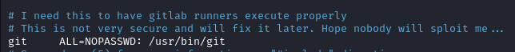

Имея доступ к запуску команды git от рута, злоумышленник мог повысить привилегии и получить полный рут доступ **(вопросы 3, 4)**. Пример команды для повышения привилегий:

```bash
sudo PAGER=’sh -c “exec sh 0<&1”‘ git -p help
```

Теперь посмотрим, как хакер мог получить постоянный рут доступ. Тот же linpeas показывает нам вот такой кусок из файла /etc/ssh/sshd_config **(вопрос 3)**:

```
PermitRootLogin yes
```

Получается, имея доступ к ssh ключам, хакер мог подключиться к ssh от рута. Проверяем папку /root/.ssh и видим файл authorized_keys:

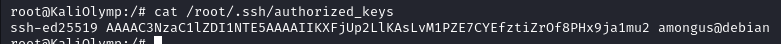

Злоумышленник добавил свой ssh ключ в список доверенных ключей системы и подключился к ssh с полными правами. **(вопрос 5)**

Там же в папке /root открываем файл .bash_history, и видим в нем запись

```bash
rm -rf /tmp/linpeas.txt
```

Значит, хакер просканировал систему через linpeas **(ответ на вопрос 7)**.

Осталось только ответить, с помощью какого ПО он закрепился в системе. Прямо в корне образа диска лежит папка XxJynx. Поиск показывает, что она принадлежит руткиту [JynxKit2](https://github.com/chokepoint/Jynx2), который и установил злоумышленник, чтобы закрепить контроль над системой **(вопрос 8)**.
